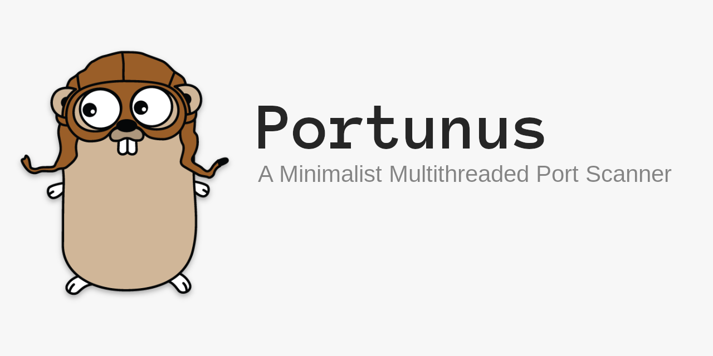

## Usage
```
Portunus -  A Minimalist Multithreaded Port Scanner
  -connections int
        Limit the maximum number of parallel connections  (default 10)
  -host string
        Hostname / IP of the target system
  -ports string
        A port OR range of ports to scan Eg. 80 or 8000-8080 or 80,21,22
  -timeout float
        Timeout in seconds (default 0.5)
```